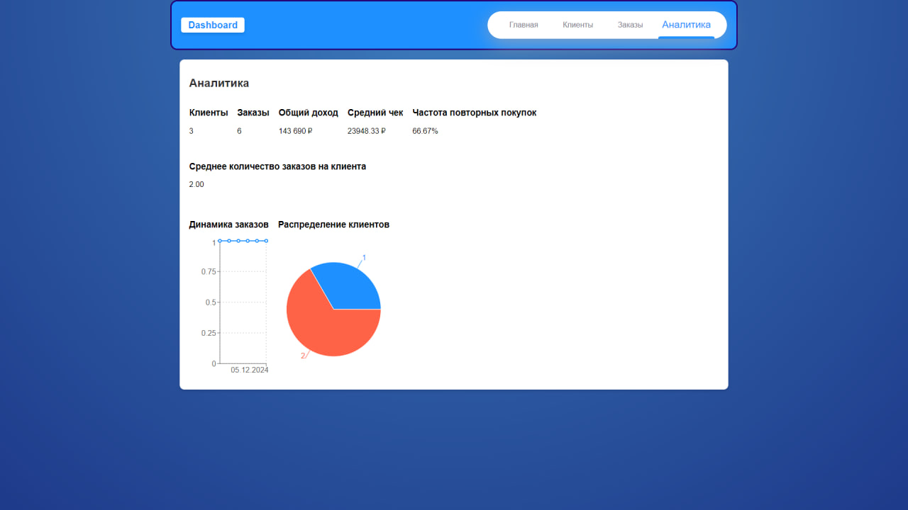
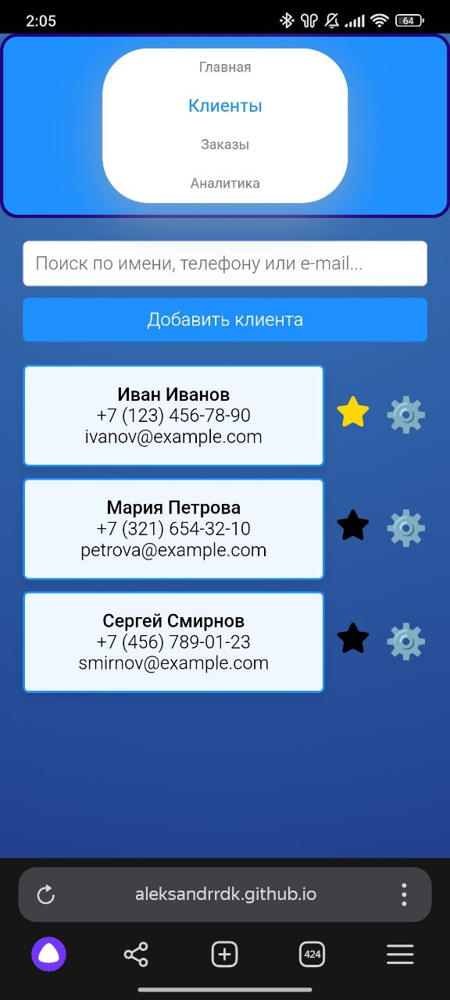

# Small Business Dashboard

Small Business Dashboard — это веб-приложение для управления данными малого бизнеса, которое предоставляет пользователям подробную аналитику и статистику по заказам и клиентам. С помощью этого проекта можно отслеживать количество заказов, анализировать повторные покупки, а также получать распределение клиентов и другие ключевые метрики.

## Демо

Демонстрацию приложения можно найти по следующей ссылке:
[Small Business Dashboard на GitHub Pages](https://aleksandrrdk.github.io/small_business_dashboard/)

## Функциональные возможности

- **Аналитическая панель**: отображение ключевых метрик, таких как количество заказов, общий доход, средний чек и частота повторных покупок.
- **Графики и диаграммы**: интерактивные графики и диаграммы для анализа данных (используется библиотека Recharts).
- **Управление пользователями**: регистрация и вход пользователей с использованием Firebase Authentication.
- **Динамическое обновление данных**: возможность обновления статистики в реальном времени.
- **Мобильная адаптивность**: корректное отображение и работа приложения на любых устройствах.
- **Безопасность данных**: аутентификация с помощью Firebase, предотвращающая несанкционированный доступ.

## Скриншоты

### Десктопная версия



### Мобильная версия



## Установка

Для локального запуска проекта выполните следующие шаги:

1. **Клонирование репозитория**:

   ```bash
   git clone https://github.com/AleksandrRDK/small_business_dashboard.git
   ```

2. **Перейдите в директорию проекта**:

   ```bash
   cd small_business_dashboard
   ```

3. **Установите зависимости**:

   ```bash
   npm install
   ```

4. **Запустите приложение**:

   ```bash
   npm start
   ```

   Приложение будет доступно по адресу [http://localhost:3000](http://localhost:3000).

## Используемые технологии

Проект реализован с использованием следующих технологий и библиотек:

- **React** — библиотека для создания пользовательских интерфейсов.
- **TypeScript** — статическая типизация для JavaScript.
- **Redux Toolkit** — для управления состоянием приложения.
- **React Router** — для маршрутизации внутри приложения.
- **Firebase** — для аутентификации пользователей и управления данными.
- **Recharts** — для создания графиков и диаграмм.
- **Scss** — для стилизации компонентов.
- **uuid** — для генерации уникальных идентификаторов.
- **Normalize.css** — для нормализации стилей на разных браузерах.

## Вклад в проект

Если вы хотите внести свой вклад, выполните следующие шаги:

1. **Сделайте форк репозитория** — создайте копию репозитория в вашем аккаунте.
2. **Создайте новую ветку** (`git checkout -b feature/new-feature`).
3. **Закоммитьте изменения** (`git commit -m 'Add new feature'`).
4. **Запушьте изменения** (`git push origin feature/new-feature`).
5. **Создайте Pull Request** в оригинальный репозиторий.

## Автор

- **AleksandrRDK**
